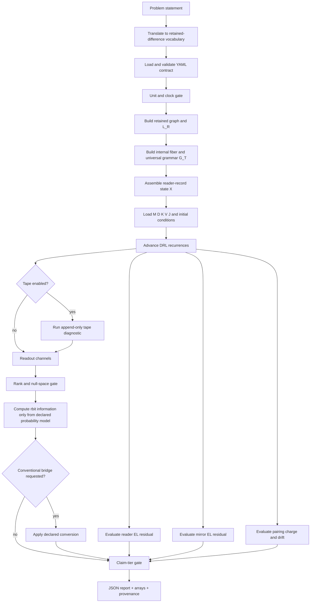

# Universal Retention–Readout System (URR)

## Native Technical Specification for AI Calculation

**Version:** 0.1.0-native  
**Date:** 2026-07-20  
**Timezone:** Asia/Bangkok  
**Author context:** Yaoharee Lahtee / Open Science–Civil Science Initiative  
**Artifact status:** working technical specification  
**Core status:** DRL derived-narrow + finite diagnostics; URR composition is a declared candidate architecture  
**Distribution status:** internal review until human review and external peer review  
**Core boundary:** no quantum postulates, no relativity postulates, and no external physical theory is part of the native kernel.

---

## Abstract

The Universal Retention–Readout System (URR) is a finite, discrete theory of
retained differences, relational transport, reader–record dynamics, and
policy-conditioned observation. Its primitive is not matter, spacetime, a
wavefunction, or a metric. Its primitive is a retained distinction:

\[
\delta_R:\quad \text{a difference exists and is kept.}
\]

A finite retained-history structure generates a relational operator
\(\mathbb G_T\). The dynamical field is doubled into a reader–record pair
\(X=(\Phi,\Psi)^\top\). The Discrete Retention Lagrangian (DRL) gives the damped
reader recurrence from a discrete action rather than inserting damping by
hand. A readout is not identified with truth: every reported value is produced
by an explicit question operator \(A_\alpha\), record \(\delta_\alpha\), and
policy \(\Pi_\alpha\). Information is measured natively in retained bits
(\(\mathrm{rbit}\)); conversion to conventional information units or physical
quantities requires a declared bridge.

This document is both a technical paper and a calculation contract. The
companion YAML file defines a machine-readable problem. The reference Python
runner constructs the graph operator, advances the DRL recurrence, evaluates
Euler–Lagrange residuals and the pairing charge, calculates readouts and null
spaces, performs information-unit conversions, and returns a tiered JSON
report.

---

# 1. Claim Discipline

Every claim and every computed output MUST carry exactly one primary tier:

| Tier | Meaning |
|---|---|
| `Th_coqc` | Machine-checked theorem in its explicitly declared scope |
| `finite_diagnostic` | Executed numerical result; evidence, not proof |
| `Dr` | Declared bridge or interpretation |
| `Open` | Candidate claim with a stated stance and falsifier |

The following promotions are forbidden:

\[
\texttt{finite\_diagnostic}\not\Rightarrow\texttt{Th\_coqc},
\qquad
\texttt{Dr}\not\Rightarrow\texttt{derived},
\qquad
\texttt{candidate}\not\Rightarrow\texttt{theory\ of\ everything}.
\]

No number may be reported as a result unless the run log records its inputs,
clock, units, solver, tolerances, and residuals.

---

# 2. Native Ontology

## 2.1 Primitive

\[
\boxed{\delta_R=\text{a retained distinction}}
\]

The primitive is pre-numeric. A retained difference becomes a numerical
information quantity only after a readout policy and probability model have
been declared.

## 2.2 Minimal retained structure

For a finite horizon \(T\), let \(\mathbf H_T\) be a finite retained-history
category or finite composable-history structure. Its linear history space is

\[
\mathcal R_T=\mathbb C[\operatorname{Mor}(\mathbf H_T)].
\]

A finite internal fiber \(\mathcal F\) may be added without assigning it an
external physical interpretation:

\[
\boxed{\mathscr H_T=\mathcal R_T\otimes\mathcal F.}
\]

In the reference implementation, \(\mathcal R_T\) is represented by a finite
weighted graph and \(\mathcal F\) by a finite-dimensional vector space.

## 2.3 Native state

Let \(d=\dim\mathscr H_T\). The native state is

\[
\boxed{
X_n=
\begin{pmatrix}
\Phi_n\\
\Psi_n
\end{pmatrix}
\in\mathscr H_T\oplus\mathscr H_T.
}
\]

- \(\Phi_n\in\mathbb R^d\): reader state, visible through a chosen readout.
- \(\Psi_n\in\mathbb R^d\): record counterpart.
- \(n\in\{0,\ldots,N_t\}\): discrete retained step.
- \(\Delta t>0\): declared step duration or dimensionless update interval.

The ontological reading of \(\Psi\) is part of the URR candidate. The linear
DRL equations alone do **not** prove an actual transfer from \(\Phi\) into
\(\Psi\); this limitation is binding.

---

# 3. Native Information Unit

## 3.1 Retained bit

The native information unit is

\[
\boxed{1\ \mathrm{rbit}}
\]

and denotes one binary, distinguishable, retained alternative under an
explicit policy \(\Pi\). The root primitive and the numerical unit must not be
collapsed:

\[
\boxed{\delta_R\neq1\ \mathrm{rbit}\quad\text{without a readout bridge}.}
\]

For a binary, equiprobable, lossless policy:

\[
\delta_R\xrightarrow[\text{binary, lossless}]{\Pi}1\ \mathrm{rbit}.
\]

## 3.2 Self-information and retained entropy

For event \(x\) with policy-conditioned probability \(p_\Pi(x)\),

\[
\boxed{I_R(x\mid\Pi)=-\log_2p_\Pi(x)\ \mathrm{rbit}.}
\]

For a distribution \(p_\Pi(i)\),

\[
\boxed{
H_R(\Pi)=-\sum_i p_\Pi(i)\log_2p_\Pi(i)\ \mathrm{rbit}.
}
\]

For \(N_\Pi\) equiprobable distinguishable states,

\[
I_R=\log_2N_\Pi\ \mathrm{rbit}.
\]

## 3.3 Conventional information-unit conversion

\[
I_{\mathrm{rbit}}=I_b\log_2 b.
\]

| Input unit | Value in rbit |
|---|---:|
| \(1\) bit | \(1\) |
| \(1\) byte | \(8\) |
| \(1\) nat | \(\log_2e\approx1.442695040889\) |
| \(1\) hartley/dit | \(\log_210\approx3.321928094887\) |
| \(1\) kbit | \(10^3\) |
| \(1\) KiB | \(8192\) |
| \(1\) MB | \(8\times10^6\) |
| \(1\) MiB | \(8\,388\,608\) |

## 3.4 Conditional physical bridge

The reference runner supports the conventional minimum erasure-heat bridge

\[
\boxed{Q_{\min}=I_R k_BT\ln2.}
\]

This means: minimum heat associated with a logically irreversible erasure
under the assumptions of the bridge. It does **not** mean that information
possesses an intrinsic energy.

Every non-information conversion must record:

\[
(\text{operator},\Pi,\text{process},\text{environment},
\text{resolution},\text{role})\longrightarrow\text{value}.
\]

---

# 4. Universal Grammar Operator

Let \(L_R\) be a weighted graph Laplacian on the retained relation graph,
\(C_{\mathcal F}\) a finite internal operator, and \(C_{\mathrm{int}}\) a
declared coupling operator. Define

\[
\boxed{
\mathbb G_T
=
L_R\otimes I_{\mathcal F}
+
I_{\mathcal R}\otimes C_{\mathcal F}
+
C_{\mathrm{int}}.
}
\]

This is an operator construction, not a claim that every possible domain has
already been derived.

For an undirected weighted graph with adjacency \(W=W^\top\),

\[
L_R=D_W-W,\qquad (D_W)_{ii}=\sum_jW_{ij}.
\]

Required numerical checks:

1. symmetry: \(\|\mathbb G_T-\mathbb G_T^\top\|\le\varepsilon_{\rm sym}\);
2. graph Laplacian row sums: \(\|L_R\mathbf1\|\le\varepsilon_{\rm row}\);
3. nonnegative Laplacian spectrum within numerical tolerance;
4. dimensions consistent with the state.

---

# 5. Discrete Retention Lagrangian

## 5.1 Structural tensors

\[
\boxed{
G=
\begin{pmatrix}
0&1\\
1&0
\end{pmatrix},
\qquad
\Omega=
\begin{pmatrix}
0&1\\
-1&0
\end{pmatrix}.
}
\]

Interpretation:

- \(G\): zero-diagonal retention metric. No reader or record has a native
  self-norm in the DRL pairing; the dynamical scalar is relational.
- \(\Omega\): antisymmetric retention structure carrying the \(D\)-term.

## 5.2 Component action

For diagonal positive \(M=\operatorname{diag}(M_i)\), diagonal
\(D=\operatorname{diag}(D_i)\), coupling \(K\), potential \(V(\Phi)\), source
\(J_n\), and \(\Delta\Phi_n=\Phi_{n+1}-\Phi_n\),

\[
\boxed{
\begin{aligned}
\mathbb L^n
={}&
\frac{1}{\Delta t}\Delta\Phi_n^\top M\Delta\Psi_n
+\frac12\left(
\Phi_n^\top D\Delta\Psi_n
-\Psi_n^\top D\Delta\Phi_n
\right)\\
&-\Delta t\left[
K\Phi_n^\top\mathbb G_T\Psi_n
+\Psi_n^\top\nabla V(\Phi_n)
-J_n^\top\Psi_n
\right].
\end{aligned}
}
\]

The discrete action is

\[
\boxed{S_{\rm DRL}[X]=\sum_{n=0}^{N_t-1}\mathbb L^n[X].}
\]

## 5.3 Homogeneous quadratic tensor form

When \(M_i=M\), \(D_i=D\), and
\(V(\Phi)=\tfrac12k_2\Phi^\top\Phi\),

\[
\boxed{
\mathbb L^n
=
\frac{M}{2\Delta t}\Delta X_n^\top(G\otimes I)\Delta X_n
+\frac{D}{2}X_n^\top(\Omega\otimes I)\Delta X_n
-\frac{\Delta t}{2}
X_n^\top
\left[G\otimes(K\mathbb G_T+k_2I)\right]X_n.
}
\]

## 5.4 Reader Euler–Lagrange recurrence

Stationarity with respect to \(\Psi_n\) gives

\[
\boxed{
M\frac{\Phi_{n+1}-2\Phi_n+\Phi_{n-1}}{\Delta t^2}
+
D\frac{\Phi_{n+1}-\Phi_{n-1}}{2\Delta t}
+
K\mathbb G_T\Phi_n
+
\nabla V(\Phi_n)
-
J_n
=0.
}
\]

For diagonal \(M,D\), the explicit update used by the runner is

\[
\boxed{
\Phi_{n+1}
=
\left(\frac{M}{\Delta t^2}+\frac{D}{2\Delta t}\right)^{-1}
\left[
\frac{2M}{\Delta t^2}\Phi_n
-\left(\frac{M}{\Delta t^2}-\frac{D}{2\Delta t}\right)\Phi_{n-1}
-K\mathbb G_T\Phi_n
-\nabla V(\Phi_n)+J_n
\right].
}
\]

The inverse is elementwise because \(M,D\) are diagonal in the reference
runner.

## 5.5 Mirror recurrence

Stationarity with respect to \(\Phi_n\) gives the anti-damped mirror:

\[
\boxed{
M\frac{\Psi_{n+1}-2\Psi_n+\Psi_{n-1}}{\Delta t^2}
-
D\frac{\Psi_{n+1}-\Psi_{n-1}}{2\Delta t}
+
K\mathbb G_T\Psi_n
+
\nabla^2V(\Phi_n)\Psi_n
=0.
}
\]

The explicit runner update is

\[
\boxed{
\Psi_{n+1}
=
\left(\frac{M}{\Delta t^2}-\frac{D}{2\Delta t}\right)^{-1}
\left[
\frac{2M}{\Delta t^2}\Psi_n
-\left(\frac{M}{\Delta t^2}+\frac{D}{2\Delta t}\right)\Psi_{n-1}
-K\mathbb G_T\Psi_n
-\nabla^2V(\Phi_n)\Psi_n
\right].
}
\]

The denominator must remain nonzero. The runner refuses configurations that
violate this algebraic update condition.

## 5.6 Supported potential

The reference runner implements the nodewise even polynomial

\[
\boxed{
V(\Phi)=\sum_i\left(\frac{k_{2,i}}2\Phi_i^2+
\frac{k_{4,i}}4\Phi_i^4\right),
}
\]

with

\[
\nabla V(\Phi)_i=k_{2,i}\Phi_i+k_{4,i}\Phi_i^3,
\qquad
\nabla^2V(\Phi)_{ii}=k_{2,i}+3k_{4,i}\Phi_i^2.
\]

Other potentials require a new adapter that explicitly supplies
`value`, `gradient`, and `hessian_diagonal` or a full Hessian.

## 5.7 Pairing charge

For centered velocities

\[
\dot\Phi_n\approx\frac{\Phi_{n+1}-\Phi_{n-1}}{2\Delta t},
\qquad
\dot\Psi_n\approx\frac{\Psi_{n+1}-\Psi_{n-1}}{2\Delta t},
\]

the nonlinear pairing charge is

\[
\boxed{
H_n
=
\dot\Phi_n^\top M\dot\Psi_n
+
K\Phi_n^\top\mathbb G_T\Psi_n
+
\Psi_n^\top\nabla V(\Phi_n)
-
J_n^\top\Psi_n.
}
\]

The runner reports relative drift as a finite diagnostic. It does not promote
a numerical drift result to a theorem.

## 5.8 Binding limitation

In the linear DRL, the two Euler–Lagrange equations decouple. Therefore,

\[
\Psi_0=0,\quad\dot\Psi_0=0
\quad\Longrightarrow\quad
\Psi_n=0
\]

even while \(\Phi\) is damped. Consequently:

> “The record receives exactly what the reader loses” is not a derived
> mechanism of the linear DRL.

The pairing interpretation is `Dr`; the transfer mechanism belongs to the
optional append-only tape layer.

---

# 6. Optional Append-Only Record Layer

This layer is native to the retained-history architecture but is not derived
from the DRL action.

For a phase vector \(z_n\), an orthogonal transport \(C_n\), and
\(0\le\gamma_n<1\),

\[
\widetilde z_n=C_nz_n,
\qquad
z_{n+1}=\sqrt{1-\gamma_n}\,\widetilde z_n,
\qquad
\rho_n=-\sqrt{\gamma_n}\,\widetilde z_n.
\]

Append the fresh record cell:

\[
\mathcal T_{n+1}=\mathcal T_n\oplus\rho_n.
\]

For \(Q(z)=\|z\|_2^2\),

\[
\boxed{
Q(z_{n+1})+Q(\rho_n)=Q(z_n)
}
\]

at every step by construction.

A declared envelope bridge may use

\[
\boxed{
\gamma_i=1-\exp\left(-\frac{D_i}{M_i}\Delta t\right).
}
\]

Status:

- exact additive conservation: construction identity;
- reversibility when all tape cells and transports are retained: construction;
- \(\gamma\leftrightarrow D/M\): declared and numerically testable bridge;
- one unified action producing both DRL and tape: `Open`.

The runner treats the tape as a separate diagnostic module and never reports
it as a derivation from the DRL action.

---

# 7. Readout Layer

## 7.1 Question operator

A readout channel \(\alpha\) declares a matrix

\[
A_\alpha:\mathbb R^{2d}\rightarrow\mathbb R^{m_\alpha}.
\]

The combined state is

\[
\bar X_n=
\begin{pmatrix}
\Phi_n\\
\Psi_n
\end{pmatrix}.
\]

The predicted record is

\[
\widehat\delta_{\alpha,n}=A_\alpha\bar X_n.
\]

## 7.2 Residual

Given observed record \(\delta_{\alpha,n}\),

\[
\boxed{
r_{\alpha,n}=A_\alpha\bar X_n-\delta_{\alpha,n}.
}
\]

An optional weighted residual energy is

\[
V_\alpha=\frac12r_\alpha^\top W_\alpha r_\alpha.
\]

## 7.3 Policy

The reported output is

\[
\boxed{
P_{\alpha,n}=\Pi_\alpha(r_{\alpha,n},
\widehat\delta_{\alpha,n},\delta_{\alpha,n}).
}
\]

Supported policies in the reference runner:

- `identity`: return predicted value and residual;
- `threshold`: compare a scalar prediction with a threshold;
- `norm`: return Euclidean norm;
- `mean`: return arithmetic mean;
- `argmax`: return index of largest predicted component.

## 7.4 Identifiability

For a linear readout matrix \(A_\alpha\),

\[
\operatorname{nullity}(A_\alpha)=2d-\operatorname{rank}(A_\alpha).
\]

If a requested quantity depends on a direction in
\(\ker A_\alpha\), the correct result is

```text
STRUCTURALLY_UNIDENTIFIABLE
```

not a guessed number.

---

# 8. One Native System Box

The native candidate is the following system—not a quantum or relativistic
completion:

\[
\boxed{
\begin{gathered}
\delta_R
\longrightarrow
\mathscr H_T
\longrightarrow
\mathbb G_T
\longrightarrow
X_n=(\Phi_n,\Psi_n)^\top,
\\[1mm]
S_{\rm DRL}[X]
=
\sum_n
\left[
\frac{1}{\Delta t}\Delta\Phi_n^\top M\Delta\Psi_n
+\frac12(
\Phi_n^\top D\Delta\Psi_n-
\Psi_n^\top D\Delta\Phi_n)
\right.\\[-1mm]
\left.
-\Delta t\left(
K\Phi_n^\top\mathbb G_T\Psi_n+
\Psi_n^\top\nabla V(\Phi_n)-
J_n^\top\Psi_n
\right)
\right],
\\[1mm]
\delta S_{\rm DRL}=0,
\qquad
r_{\alpha,n}=A_\alpha X_n-\delta_{\alpha,n},
\qquad
P_{\alpha,n}=\Pi_\alpha(r_{\alpha,n}),
\\[1mm]
I_R(x\mid\Pi)=-\log_2p_\Pi(x)\ \mathrm{rbit}.
\end{gathered}
}
\]

All external interpretations are optional user-supplied readout adapters and
are not part of the core.

---

# 9. Computational DAG



---

# 10. Normative Pseudocode

```text
PROCEDURE URR_RUN(config):

    VALIDATE config.required_fields
    REQUIRE config.meta.native_only == true
    REQUIRE config.dynamics.dt > 0
    REQUIRE all(M_i > 0)
    REQUIRE all(D_i >= 0)

    L_R <- BUILD_WEIGHTED_LAPLACIAN(config.graph)
    C_F <- LOAD_INTERNAL_OPERATOR(config.fiber)
    C_int <- LOAD_INTERACTION_OPERATOR(config.grammar)
    G_T <- KRON(L_R, I_F) + KRON(I_nodes, C_F) + C_int

    CHECK symmetry, dimensions, row-sum and spectrum diagnostics

    phi[0], vphi[0], psi[0], vpsi[0] <- initial conditions
    phi[-1] <- second_order_backward_start(phi[0], vphi[0])
    psi[-1] <- second_order_backward_start(psi[0], vpsi[0])

    FOR n IN 0 .. steps-1:
        J_n <- source(n)

        phi[n+1] <- reader_update(
            phi[n], phi[n-1], M, D, K, G_T,
            gradV(phi[n]), J_n, dt
        )

        psi[n+1] <- mirror_update(
            psi[n], psi[n-1], phi[n], M, D, K, G_T,
            HessV(phi[n]), dt
        )

    reader_residual <- MAX_NORM(EL_reader(phi))
    mirror_residual <- MAX_NORM(EL_mirror(psi, phi))
    H_series <- pairing_charge(phi, psi, source)
    H_drift <- relative_drift(H_series)

    IF record_backend IN {"tape", "hybrid"}:
        tape_report <- RUN_APPEND_ONLY_TAPE(config.tape)
    ELSE:
        tape_report <- SKIPPED

    FOR each readout alpha:
        A <- BUILD_READOUT_MATRIX(alpha)
        prediction <- A @ CONCAT(phi_final, psi_final)
        residual <- prediction - observed
        rank <- MATRIX_RANK(A)
        nullity <- 2*d - rank
        output <- APPLY_POLICY(alpha.policy, prediction, residual)

    IF explicit probability model exists:
        rbit_report <- COMPUTE_INFORMATION(probabilities)
    ELSE:
        rbit_report <- NOT_COMPUTED("probability model missing")

    FOR each requested unit bridge:
        REQUIRE bridge assumptions and parameters
        converted_value <- APPLY_BRIDGE(rbit_report, bridge)

    verdict <- CLAIM_GATE(
        residuals,
        tolerances,
        unsupported_modules,
        bridge_status,
        identifiability
    )

    WRITE machine-readable JSON report
    RETURN report
```

---

# 11. YAML Contract

The machine-readable contract is stored in `urr_system_spec.yaml`. A runnable
example is stored in `example_ring.yaml`.

Required top-level keys:

```yaml
meta:
ontology:
units:
graph:
fiber:
grammar:
dynamics:
potential:
source:
initial_state:
record_backend:
readouts:
information:
diagnostics:
claim_policy:
dag:
```

The runner rejects missing required keys, inconsistent dimensions, implicit
unit conversions, unsupported potentials, and singular explicit-update
denominators.

---

# 12. Output Contract

The runner emits JSON with:

```yaml
meta:
  run_id:
  timestamp_utc:
  spec_version:
  input_sha256:
operator:
  state_dimension:
  laplacian_eigenvalues:
  grammar_eigenvalues:
  symmetry_error:
dynamics:
  action:
  reader_el_residual_max:
  mirror_el_residual_max:
  pairing_charge_initial:
  pairing_charge_final:
  pairing_charge_relative_drift:
tape:
  status:
  conservation_error:
readouts:
  - id:
    prediction:
    observed:
    residual:
    policy_output:
    rank:
    nullity:
information:
  entropy_rbit:
  self_information_rbit:
  conversions:
claim:
  tier:
  verdict:
  passed_gates:
  failed_gates:
  not_checked:
limitations:
provenance:
```

Arrays are saved separately as an `.npz` artifact.

---

# 13. Claim and Novelty Ledger

## 13.1 Derived or checked within declared scope

| Item | Status |
|---|---|
| Reader damped recurrence from the discrete DRL action | `Th_coqc` in declared finite scope + `finite_diagnostic` |
| \(D\)-term cancellation in the Legendre pairing structure at general node count | `Th_coqc`, axiom-free in its formal scope |
| Nonlinear pairing-charge numerical behavior for implemented cases | `finite_diagnostic` |
| Weighted graph and finite-difference calculations in this runner | `finite_diagnostic` only |

## 13.2 Candidate novelty

The novelty claim is narrow:

1. the discrete graph-tensor DRL form coupling the reader–record pair through
   \(G\otimes L_R\);
2. the ontic reading of \(\Psi\) as a record required by retention rather than
   a disposable auxiliary variable;
3. the zero-diagonal retention metric \(G\) as the Doctrine of Quantity in
   dynamical form;
4. the unified native calculation contract joining DRL, explicit readout,
   identifiability, claim tiers, and rbit bridges without importing an external
   fundamental theory.

These remain:

```text
Open, with a positive stance, pending external peer review and literature falsification.
```

## 13.3 Not novel individually

The following ingredients must not be claimed as individually new:

- graph Laplacians;
- doubled-variable variational methods;
- discrete variational integration;
- Shannon self-information and entropy;
- bits, nats, bytes, and Landauer erasure bounds;
- matrix rank and null-space identifiability.

## 13.4 Explicit non-claims

This specification does not claim:

- a completed theory of everything;
- a derivation of all domains from RD1–RD9;
- that \(\Psi\) receives reader loss in the linear DRL;
- that the tape map is derived from the DRL action;
- that an rbit is intrinsically a joule, kilogram, metre, or second;
- that a finite diagnostic is a proof;
- that a readout equals truth.

---

# 14. Required Diagnostics and Failure Codes

| Code | Meaning |
|---|---|
| `PASS` | All requested gates passed |
| `INVALID_SCHEMA` | YAML structure or type invalid |
| `DIMENSION_MISMATCH` | Operator/state dimensions disagree |
| `INVALID_UNIT_BRIDGE` | Conversion requested without assumptions |
| `SINGULAR_UPDATE` | Explicit DRL denominator is zero or too small |
| `NONFINITE_STATE` | NaN or infinity produced |
| `EL_RESIDUAL_FAIL` | Euler–Lagrange residual exceeds tolerance |
| `PAIRING_DRIFT_WARN` | Pairing-charge drift exceeds diagnostic tolerance |
| `STRUCTURALLY_UNIDENTIFIABLE` | Requested result lies in a readout null space |
| `UNSUPPORTED_POTENTIAL` | Potential adapter absent |
| `BRIDGE_ONLY` | Result depends on a declared, non-derived bridge |
| `OPEN_CLAIM` | Requested promotion exceeds evidence |

---

# 15. Reproducibility

Install:

```bash
python -m pip install numpy pyyaml
```

Run:

```bash
python urr_reference_runner.py example_ring.yaml --output run_report.json
```

Smoke test:

```bash
python smoke_test.py
```

Expected properties, not hard-coded exact numbers:

1. graph and grammar dimensions pass;
2. Euler–Lagrange residuals are near floating-point precision because the
   recurrences are evaluated by the same declared discretization;
3. action and pairing-charge diagnostics are finite;
4. the readout rank and nullity are reported;
5. information conversions are computed only when probabilities are supplied;
6. the output tier remains `finite_diagnostic`;
7. no quantum or relativity module appears.

---

# 16. Source Grounding

Canonical project sources used to construct this specification:

- `readout_universe/v2/DISCRETE_RETENTION_LAGRANGIAN.md`
- `readout_universe/v2/APPEND_ONLY_RECORD.md`
- `readout_universe/v2/INFORMATION_DNA.md`
- `readout_universe/v2/TRANSLATION_PROTOCOL.md`
- `readout_universe/v2/DOCTRINE_OF_QUANTITY.md`
- `readout_universe/v2/EVERYTHING_BRIDGE.md`
- `readout_universe/README.md`
- `evidence/DRL_Discrete.v`
- `evidence/DRL_General_Legendre.v`
- Paper I: *The Discrete Retention Lagrangian*

Repository snapshot consulted: `morrocwi/readout_universe`, main commit
`3cd940c33bba73803312ffe8254cd2224181b47f`.

---

# 17. Final Native Statement

\[
\boxed{
\text{URR is a finite theory of retained distinction, relational grammar,
reader–record dynamics, and policy-conditioned readout.}
}
\]

It does not need to reproduce another theory to possess a native identity.
External users may design additional readout adapters, but those adapters do
not alter the kernel and do not inherit its evidence tier automatically.
